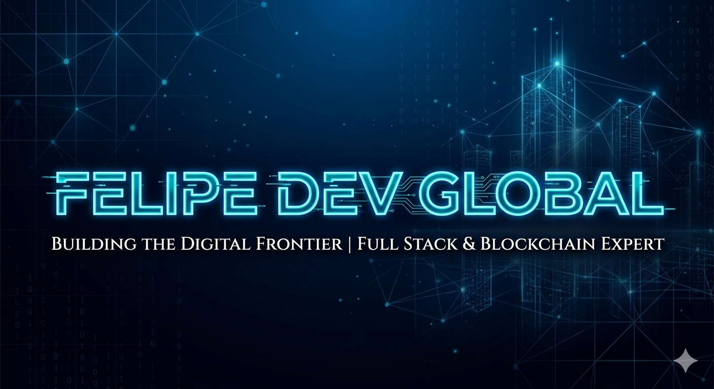
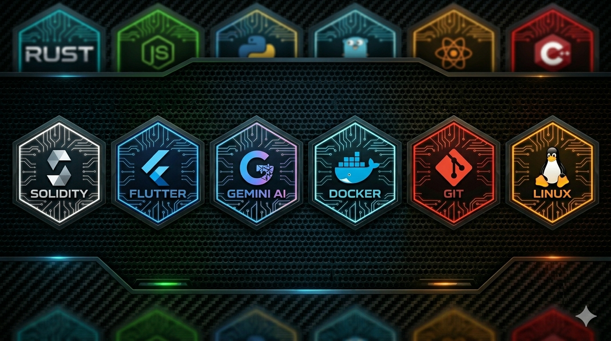

  

  

### 🚀 Full Stack Software Engineer | Blockchain Expert | Tech Lead

Engenheiro de Software focado em arquiteturas de alta performance, descentralização e soluções disruptivas. Especialista em transformar visão de negócios em código escalável, com forte atuação em sistemas financeiros e e-commerce global.

---

### 🛠️ O Que Eu Construo (High-Scale Systems)

*   **Sistemas Financeiros de Alta Frequência:** Arquitetados para transações ultra velozes (Ultra Flash Rate) e descentralização total. Core em Rust para máxima performance.
*   **Ecossistemas Completos de E-commerce:** Marketplace, logística avançada e onboarding inteligente de sellers.
*   **Motores de Processamento Visual Inteligente:** Integração via PWA com análise de dados em tempo real.
*   **Segurança Ofensiva & Infra Distribuída:** Frameworks de monitoramento preventivo e integridade de sistemas distribuídos.
*   **Engines de Baixo Nível & Automação:** Desenvolvimento de core engines focado em otimização extrema de hardware e CLIs para workflows Full Stack.

---

### 📡 Conecte-se com a Vanguarda Digital

*   **LinkedIn:** Felipe Pupo
*   **Email:** pupolove15@gmail.com
*   **Localização:** Rancharia, SP - Brazil 🇧🇷 | Disponibilidade Global

> *“Architecting the future of decentralization, one ultra-fast block at a time.”*
